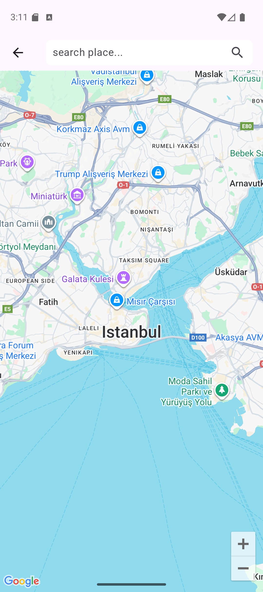
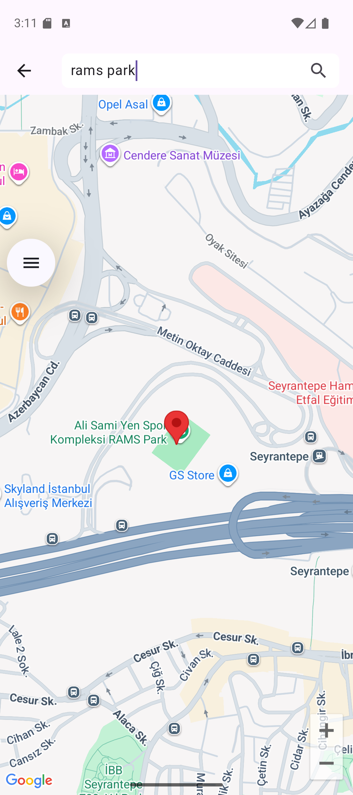

# 🌍 Maps with Flutter

A Flutter application that integrates **Google Maps** and **OpenStreetMap** search.  
Users can search for places and see them marked on the map with a red marker.  

---

## ✨ Features

- Display Google Maps in Flutter
- Search for a location using **OpenStreetMap API**
- Add a red marker for searched locations
- Animate camera to searched location (zoom level 16)
- My Location button enabled

---

## 📸 Screenshots

  

    
    
Home Screen

  

  

    
    
Maps Screen

  

  

    
    
Search Marker

  

